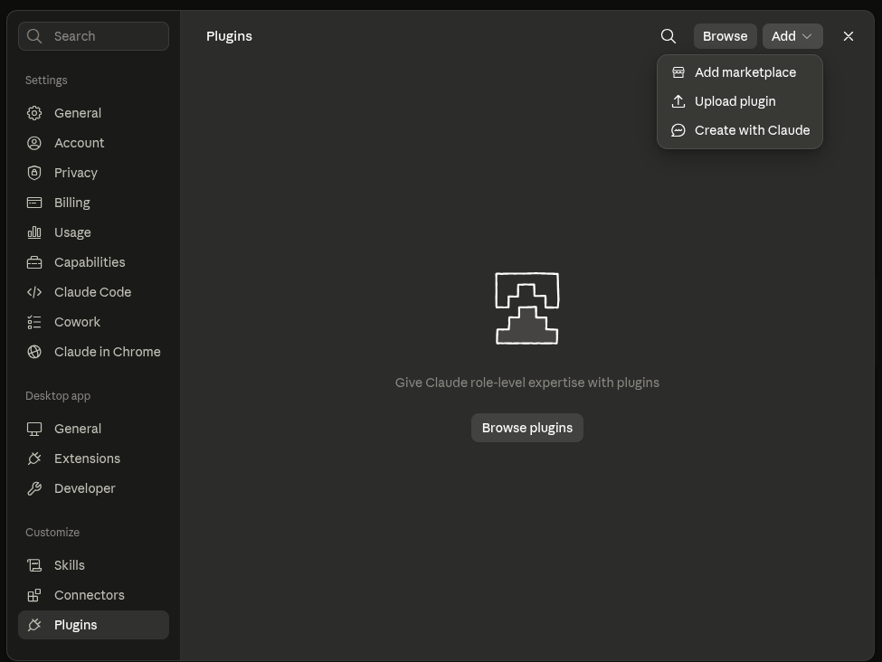
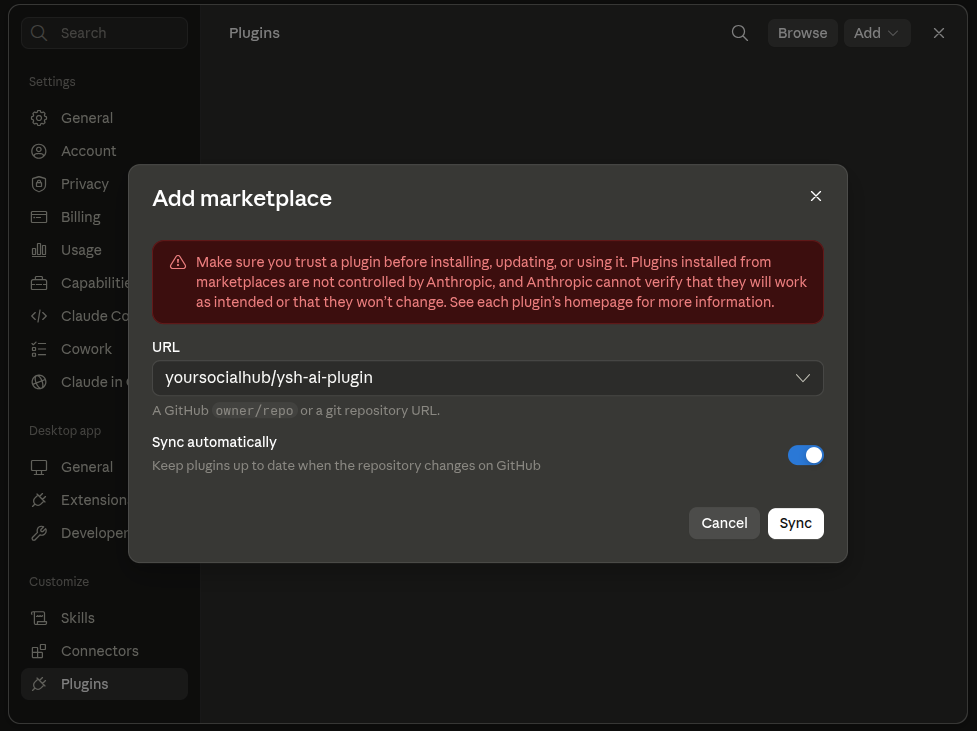
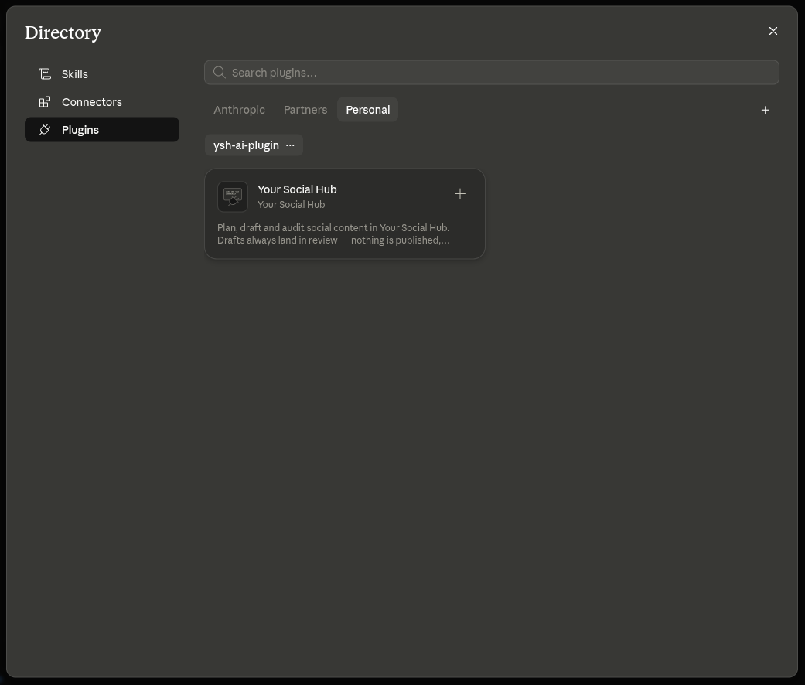
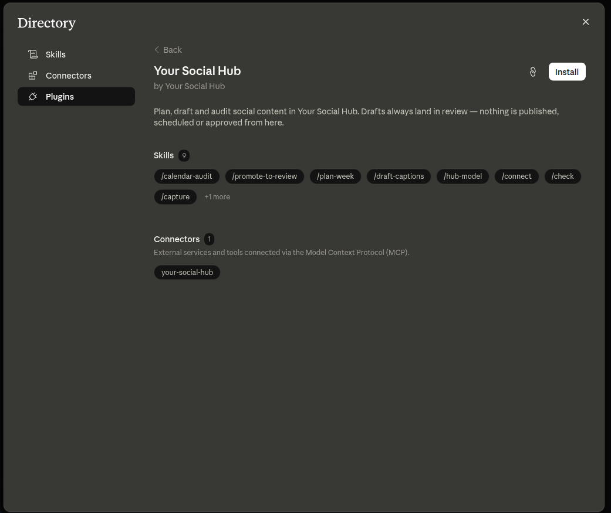
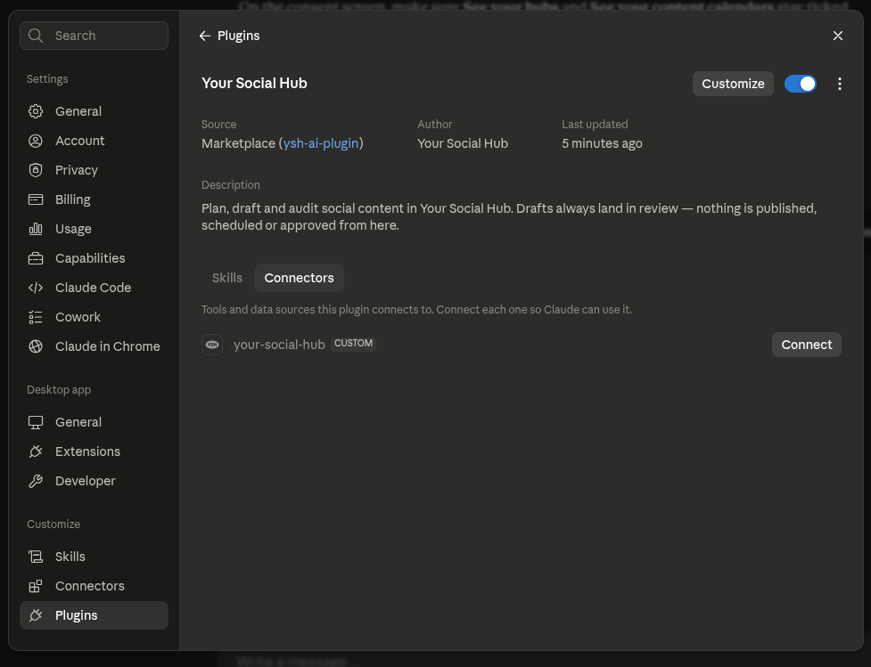

# Installing Your Social Hub in Claude Cowork

A step-by-step walkthrough, written for people who have never installed a Claude plugin before. It takes about five minutes, and you never leave the app except to sign in to Your Social Hub.

By the end, you will be able to ask Claude things like *"what's stuck in the August calendar?"* or *"draft five carousel ideas for the launch"*, and it will work directly in your hub.

---

## Before you start

You need three things:

1. **The Claude desktop app**, signed in. Cowork lives inside it.
2. **A Your Social Hub account** at [yoursocialhub.online](https://www.yoursocialhub.online).
3. **The `content_creator` or `admin` role in at least one hub.** This matters more than it sounds: a reviewer-only account can complete every step below and still see no data at the end, because the plugin respects exactly the permissions you already have. If you are not sure which role you have, ask whoever set up your hub.

You do **not** need to install anything else, use a terminal, or know what MCP or OAuth mean.

---

## Step 1 — Open the plugin settings

In the Claude desktop app, open **Settings**, then find the **Customize** group in the left-hand sidebar and click **Plugins**.

You should land on a mostly empty screen that says *"Give Claude role-level expertise with plugins"*. That is the right place.

## Step 2 — Add the Your Social Hub marketplace

A "marketplace" is just the place Claude downloads the plugin from. You add it once.

In the top-right corner, click **Add**, then choose **Add marketplace**.



## Step 3 — Enter the address and sync

In the **URL** field, type exactly:

```
yoursocialhub/ysh-ai-plugin
```

Leave **Sync automatically** switched on — that is what keeps the plugin up to date when we ship improvements.

Then click **Sync**.



**About that red warning.** Claude shows it above *every* third-party plugin, from anyone. It means Anthropic did not build this plugin and does not vet it — not that anything is wrong. Three things are worth knowing before you continue:

- The full source is public at [github.com/yoursocialhub/ysh-ai-plugin](https://github.com/yoursocialhub/ysh-ai-plugin) — nothing is hidden.
- You sign in on the Your Social Hub website, in your own browser. The plugin never sees your password.
- It **cannot publish, schedule, approve, reject or delete anything.** Everything it writes lands in the review queue, where a person still has to approve it. The full list of what it can and cannot do is in [info.md](../info.md).

## Step 4 — Find the plugin

The Directory opens. Click the **Personal** tab, and you will see a chip labelled `ysh-ai-plugin` — that is the marketplace you just added — with the **Your Social Hub** plugin underneath it.

Click the plugin card.



## Step 5 — Install it

You now see what the plugin contains: nine skills and one connector. Click **Install** in the top-right corner.



## Step 6 — Connect it to your account

Installing gives Claude the know-how. Connecting gives it access to *your* hub. Both are needed — this second half is the step people most often forget.

On the plugin's page, open the **Connectors** tab and click **Connect** next to `your-social-hub`.



## Step 7 — Sign in and approve the permissions

Your browser opens on the Your Social Hub sign-in page. Sign in as you normally would.

You then get a consent screen listing what Claude is asking for — reading your hubs, content calendars, content and ideas, and creating drafts and ideas.

**Leave every box ticked** and approve.

You *can* untick individual items, but an unticked permission does not merely limit Claude — it removes those abilities entirely, and the related features stop existing rather than telling you why. If you want to be cautious, the read-only permissions alone are a reasonable choice; just know that Claude will then be unable to save anything for you.

When you are done, the browser tells you to return to Claude, and the connector shows as connected.

---

## Check that it actually works

Two quick checks, in order.

**1. Ask the plugin to describe itself.** In a Cowork chat, type `/` and pick **check** from the list (it may show as `your-social-hub:check`). It reports which tools and permissions you actually ended up with. If it lists tools, the connection is live.

**2. Ask a real question.** Try:

> Which hubs do I have access to?

If Claude names your hubs, you are done. Everything else — planning a week, auditing a calendar, drafting captions — works from plain requests like *"plan next week from the Ideas Hub"*. See [info.md](../info.md) for what it is good at.

---

## If something went wrong

| What you see | What it means | What to do |
| --- | --- | --- |
| No **Plugins** entry in the sidebar | You are in the web app, not the desktop app | Open the Claude desktop app and try again |
| "Marketplace not found" after Sync | Typo in the address | It is `yoursocialhub/ysh-ai-plugin` — no `https://`, no `.git`, one slash |
| Plugin installed, but Claude ignores your hub | Installed but not connected | Go back to Step 6 — installing and connecting are separate |
| Claude says it has no such tools | The connector is disconnected, or permissions were unticked | Run **check**, then reconnect from the plugin's Connectors tab |
| "You don't have access" on every hub | Your account is reviewer-only | Ask a hub admin for the `content_creator` role |
| Claude sees hubs but cannot save ideas or drafts | The write permissions were unticked on the consent screen | Disconnect, connect again, and leave every box ticked |
| It worked yesterday, not today | The authorization was revoked or expired | Reconnect from the plugin's Connectors tab |

Still stuck? Run **check** and include its output when you ask for help — it says precisely which tools and permissions are present.

---

## Turning it off

- **Pause it:** the toggle on the plugin's page in Settings → Plugins.
- **Cut off access to your data:** Your Social Hub → Profile & Billing → **Connected Apps** → revoke. This works even if you never open Claude again.
